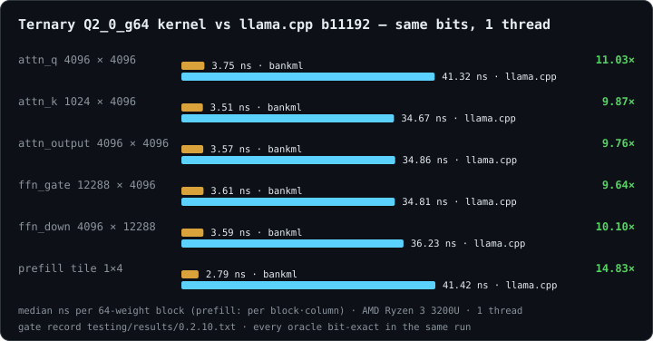
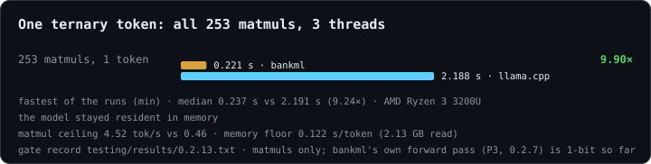
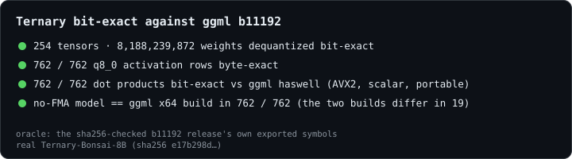
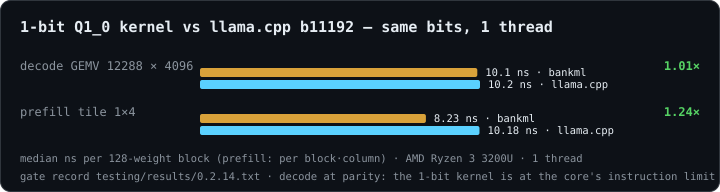
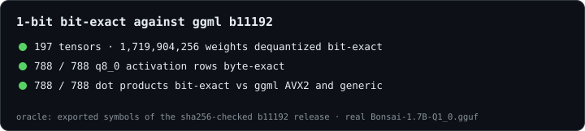

<h1 align="center">bankML</h1>

<p align="center">
  <b>Verified low-bit inference for the CPU you already have.</b><br>
  A zero-dependency Rust runtime for 1-bit and ternary language models — bit-exact against llama.cpp, then faster.<br><br>
  <a href="https://github.com/Professor-Codephreak">Professor Codephreak</a> &middot; Gregory L. Magnusson &middot;
  <a href="https://github.com/cryptoAGI">cryptoAGI</a>
</p>

<p align="center">
  
  
  
  
  
  
  
  <a href="https://github.com/cryptoAGI/bankml/releases/latest"></a>
  <a href="https://deltaverse.pythai.net/bankml"></a>
</p>

<p align="center">
  <a href="https://deltaverse.pythai.net/bankml"><b>Why bankML</b></a> (the short version, on the web) &middot;
  <a href="docs/thesis.md"><b>the thesis</b></a> &middot; <a href="#summary-limitations-and-next-steps"><b>limits and next steps</b></a> &middot; <a href="docs/usage.md"><b>usage</b></a> &middot;
  <a href="CHANGELOG.md"><b>changelog</b></a> &middot;
  <a href="https://huggingface.co/spaces/PYTHAI/bankml"><b>on Hugging Face</b></a>
</p>

> **Latest release: [v0.4.2](https://github.com/cryptoAGI/bankml/releases/tag/v0.4.2)** (2026-10-08, [record](testing/results/0.4.2.txt)):
> logprobs on Ollama's API with llama-server b11192's numbers, receipts that hash them (`logprobs_sha256`), `max_tokens: 0`
> as llama-server answers it, a request whose client has gone stopped, ternary on the GPU bit-exact, CI on ARM, one
> theme with a dark-mode switch for the console and Savante, Savante's exact calculator, `install.sh restart`
> ([CHANGELOG](CHANGELOG.md)).
>
> **The milestone: [v0.4.0](https://github.com/cryptoAGI/bankml/releases/tag/v0.4.0) — native serving
> complete** (2026-10-07; every stage of the gate passed, [record](testing/results/0.4.0.txt)). Everything Savante and
> mindX ask of llama-server is answered by bankML's own engine, identical to llama-server b11192:
> - **1-bit decode at least at llama-server's speed.** The pinned 8B A/B: 3 of 3 rounds, median 2.02 against 0.77
>   tokens/s under the same load, every answer identical
>   ([the test, with the machine's load](docs/PERFORMANCE.md#1-bit-decode-against-llama-server-040)). So `auto` now
>   takes the 1-bit files as well as the ternary ones.
> - **A q8_0 KV cache** with llama.cpp's Hadamard rotation (53 % of the memory, 6 / 6), and the grammar mask 13× faster.
> - **The serving contract:** the context limit, slots, a prompt cache for conversations that take turns, and
>   logprobs, all identical to llama-server.
> - **It shows its work:**
>   - a status page on the engine's own address;
>   - the console's ultimate-input-field landing, and its Engine, Diagnostics and Thesis tabs;
>   - `scientific.diagnostic`: 32 / 32 tokens bit-equal to 18 decimals.
> - **The kernels at three threads:** 1-bit 1.02× and ternary 8.9× ggml b11192's own.
>
> **The thesis — Professor Codephreak and Gregory L. Magnusson.** *Exact and precise first, then efficient and optimized.*
> 1. Port what works, and only what works.
> 2. Optimization, succinct, and verified response.
> 3. The standing machine is the CPU you already have.
> 4. Consume the inference, and prefer the better answer.
> 5. Know the limit, and code around it.
> 6. Improve by increments, with the oracle in the loop.
> 7. Use the machine at hand.
> 8. Prove the data; keep the data.
>
> [The Thesis and its sixteen contributions](docs/TECHNICAL.md#thesis--professor-codephreak-and-gregory-l-magnusson) ·
> [the argument, with the contemporary field](docs/thesis.md) · [hear it read](https://rage.pythai.net/bankML-thesis)

---

## Where it stands (2026-10-08)

**[v0.4.2](https://github.com/cryptoAGI/bankml/releases/tag/v0.4.2) is the latest release** (gate passed, every stage), on
[v0.4.0](https://github.com/cryptoAGI/bankml/releases/tag/v0.4.0), the milestone: native serving complete. What comes next is in [TODO.md](docs/TODO.md) (0.4.x, then 0.5.0 — hardware):

| release | state | what it brings |
|---|---|---|
| **0.3.7** | **released** 2026-10-06 | llama-server's whole default sampler chain (DRY, XTC, top-n-σ, typical-p, dynamic temperature); bankML measures itself (time to first token, tokens/s, energy); a GPU limiter; the bankML console |
| **0.3.8** | **released** 2026-10-06 | llama-server's behaviour at the context limit; slots saved and restored; a host prompt cache, so conversations taking turns keep their context; logprobs, streamed or not; the plain-language [why-bankml.md](docs/why-bankml.md) |
| **0.4.0** | **released** 2026-10-07 — the milestone | native serving complete: everything Savante and mindX ask of llama-server, with bankML's own engine chosen by default for 1-bit and ternary models ([TODO.md](docs/TODO.md)); with it: a q8_0 conversation memory with llama.cpp's Hadamard rotation (53 % of the f16 cache, 6 / 6 answers identical); the grammar mask 13× faster at the median; a code audit and full docs pass; [thesis.md](docs/thesis.md). Left: 1-bit decode measured against llama-server, pinned and idle |
| **0.4.2** | **released** 2026-10-08 | with 0.4.1 (never tagged): logprobs on Ollama's API and `logprobs_sha256` on receipts; `max_tokens: 0` as llama-server; a request whose client has gone stops; GPU objects released on drop; ternary on the GPU bit-exact; CI on aarch64; the console and Savante in one theme with a dark-mode switch; Savante's calculator; `install.sh restart` |

## Summary, limitations and next steps

**In one paragraph.** bankML is a Rust runtime for 1-bit, ternary and F16 language models, in one crate with no
dependencies. It computes exactly what llama.cpp b11192's compiled code computes, bit for bit, and it measures speed
only after that is proven. Other Rust inference engines exist, among them llama-rs/`llm`, candle, mistral.rs and
OxiLLaMa. What bankML adds is the standard it holds itself to: the same bits as the reference, checked by oracles in
the gate, through the whole model and the server, not only the tokenizer. With those bits fixed, it found that the
reference has no vectorised x86 kernel for ternary weights, and it closed that gap without changing a single answer.

**What is proven** (each claim re-run by the gate, records in [testing/results](testing/results)):
- **Kernels:** every weight of Bonsai-1.7B and Bonsai-8B (1-bit) and Ternary-Bonsai-8B is bit-exact. The ternary
  matrix work runs 9.4–10.0× faster than llama.cpp's.
- **The whole model:** every row of every layer and all 151,669 logits are bit-exact. Greedy and seeded answers are
  the reference's tokens.
- **Serving:** conversations, the prompt cache, JSON mode, grammars, schemas, the whole sampler chain and logprobs
  all match llama-server, turn by turn and float by float. This holds through the OpenAI API, Ollama's API and the
  C API.
- **The GPU:** bankML writes its own shader code (SPIR-V, no SDK). A card does work only after `bankml gpu --verify`
  shows on that card that it gives the CPU's bits.

**Does the code conclude the thesis?** Not yet, and the thesis says when it will: at 1.0, when its six conditions
hold ([TODO.md](docs/TODO.md#the-road-from-030-to-100)).

| 1.0 condition | where it stands at 0.4.2 |
|---|---|
| llama.cpp only as the oracle, never at run time | **partly.** The native engine is the default for 1-bit and ternary files, but `install.sh` still fetches llama-server b11192 |
| every architecture × format has its oracles and passes them | **met for what is supported:** Qwen3 and Llama × Q1_0, Q2_0_g64 and F16 |
| at least the reference's speed on every format, on named machines | **partly.** Ternary is well ahead and 1-bit is level or ahead. F16 decode is about 0.93×, and everything was measured on one laptop |
| stable interfaces under semver | **not yet** (0.x) |
| signed receipts and a verifier anyone can run | **not yet.** Receipts are unsigned |
| Savante and mindX run on bankML by default | **largely.** It has been mindX's default engine on its VPS since 0.3.6 |

**Limitations, stated:**
- **Narrow coverage.** Two architectures (Qwen3, Llama) and three weight types (`Q1_0`, `Q2_0_g64`, F16).
  Everything else is refused with the reason. Llama 3.x is refused too, because its rope factors and pre-tokenizer
  are not done.
- **One reference build.** Bit-exactness is against b11192's haswell build on x86 with AVX2. Other builds and
  instruction sets need their own oracles.
- **Measured on one machine.** Speed figures come from one laptop (Ryzen 3 3200U, 5.8 GB). On that laptop the
  whole-token ternary gain falls to 2.1–3.6× when the 2.3 GB model does not stay cached.
- **The 1-bit decode lead was measured on a loaded machine.** The pinned A/B gave a median of 2.63× over 3 of 3
  rounds, but the laptop was busy at the time; an idle re-run is still owed.
- **One GPU.** The GPU is proven only on an integrated AMD Vega 3, and the ternary GPU kernel is not yet used for
  inference.
- **Serving limits.** One conversation slot (as `-np 1`), no continuous batching, unsigned receipts.

**Next steps** (from [TODO.md](docs/TODO.md)):
1. **0.4.x:**
   - put the ternary kernel to work on the GPU (a share of each matrix, bit-exact);
   - re-measure 1-bit decode on an idle machine.
2. **0.5.0, hardware:**
   - the F16 GPU kernel, and batched GPU submissions;
   - a vendor matrix (AMD discrete, NVIDIA, Intel), each card proven by `--verify`;
   - AVX-512/VNNI kernels, NEON for ARM, and CI on x86 without AVX2.
3. **0.6.0, more models:**
   - Qwen3.8, the ternary line beyond Bonsai-8B, then IBM Granite and GLM on GPU;
   - Llama 3.x.
4. **0.7.0–0.9.0:**
   - mindXtrain in Rust, end to end;
   - signed receipts and a public verifier;
   - an installer that no longer fetches llama-server;
   - the release candidate.
5. **1.0.0:** all six conditions above met, each with its record.

## Why

An 8-billion-parameter model quantized to one bit per weight fits in 1.2 GB; its ternary sibling in 2.3 GB. Both run
on a laptop or a two-core server. On such machines the ternary model gives the **better answers** — and llama.cpp
serves it **five to seven times slower** than the 1-bit one.

bankml found why and fixed it at the kernel: **llama.cpp b11192 has no vectorised x86 kernel for ternary (`Q2_0`)
at all** — it runs scalar C with 64 integer multiplies per block. bankml's kernel computes the **same bits**, verified
against llama.cpp's own compiled library on all 8.19 billion weights of the model, **9.4–10.0× faster** per matrix
(the 0.2.2 gate record; every gate since 0.0.1 has measured 9.4–10.8×).

The argument in full — exactness and precision first, then efficient, optimized speed, and why the discipline finds speed rather than costing it — is
**[docs/thesis.md](docs/thesis.md)**.

## Install and use

Six steps, from a fresh machine to verified answers. Each is detailed in [docs/usage.md](docs/usage.md).

**1. Install.** One command: it checks the machine (Rust 1.99+, Python 3.10+, AVX2), builds and tests bankML,
fetches llama.cpp b11192 (sha256-checked, used as the oracle and the fallback engine), imports Bonsai-8B and verifies
it, and starts Savante's page. Nothing needs sudo.

```sh
git clone https://github.com/cryptoAGI/bankml && cd bankml
./install.sh                     # or: bash install.sh
```

**2. Talk to Savante.** Open **http://127.0.0.1:7873** (this computer only). `./install.sh status` shows what runs and
which model was verified; `./install.sh stop` stops it all; `./install.sh start --view` adds a read-only page for
your network.

**3. Serve a model yourself.** `bankml serve` refuses to start unless the file passes the guard and its sha256 equals
its `FORK.json` pin. `--native` answers from bankML's own forward pass; `--registry` serves every pinned model by name,
one resident at a time, each verified again when it loads.

```sh
target/release/bankml verify .models/Bonsai-8B-Q1_0.gguf --fork FORK.json        # the gate, on its own
target/release/bankml serve  .models/Bonsai-8B-Q1_0.gguf --fork FORK.json --native --registry --ctx 2048
```

**4. Ask it, the OpenAI way or the Ollama way** (it listens on `127.0.0.1:18093`; POSTs need
`Content-Type: application/json`). Every answer carries a `bankml_receipt`: the model's sha256, the request's and the
answer's.

```sh
curl -s 127.0.0.1:18093/v1/chat/completions -H 'Content-Type: application/json' \
  -d '{"messages":[{"role":"user","content":"Say hello."}],"max_tokens":32,"repeat_penalty":1.3}'
curl -s 127.0.0.1:18093/api/chat -H 'Content-Type: application/json' \
  -d '{"model":"bonsai-8b-q1_0","messages":[{"role":"user","content":"Name a cat."}],"stream":false,
       "format":{"type":"object","properties":{"name":{"type":"string"}},"required":["name"]}}'
```

**5. Make your own model.** `bankml convert` turns a merged safetensors directory into a GGUF byte-identical to
llama.cpp's converter; `bankml create` lays a Modelfile's persona over a pinned model as a verified layer.

```sh
target/release/bankml create mymodel -f Modelfile     # FROM a pinned GGUF, a name, or a safetensors directory
```

**6. Check it, and build it by hand.**

```sh
cargo build --release && cargo test --release          # offline unit and end-to-end tests
target/release/bankml version                          # the build; `bankml gpu` lists the video cards it may use
```

From another program: [docs/CAPI.md](docs/CAPI.md) (`libbankml`, `bankml.h`). As an Ollama for mindX:
[docs/OLLAMA.md](docs/OLLAMA.md). What each source file does, and its limits: [docs/modules/](docs/modules/).

## 0.3.0 — bankML answers Savante itself

Since 0.3.0, `bankml serve --native` answers Savante from **bankML's own forward pass**, with no llama-server
underneath. It is built from zero-dependency Rust, step by step since 0.2.1, and every step is proven against
llama.cpp b11192:
- **the same tokens:** the tokenizer, the chat template, every layer and all 151,669 logits bit-exact, and all
  three of ggml's CPU attention kernels. Greedy and seeded sampling give llama-server's tokens on every oracle case,
  and whole Savante-style conversations through llama-server's own chat endpoint are **identical turn by turn**:
  the text, the token counts and the prompt-cache reuse (9 of 9 turns);
- **faster where llama.cpp is weakest:** on the ternary model, 2.3–2.4 tokens/s against llama-server's 0.30, about
  8×, with the same tokens. On the 1-bit model llama-server was still faster at 0.3.0 (2.8 against 1.9–2.0), so
  Savante's default engine setting, `auto`, uses bankML for the ternary files and llama-server for the rest. After
  0.3.4's attention work one loaded-machine pair read 2.30–2.59 against 2.33–2.48; in 0.4.0 the pinned 8B A/B
  (`testing/decode_ab.py`) put bankML at or above llama-server in 3 of 3 rounds (median 2.02 against 0.77 tokens/s
  under the same load, answers identical), so `auto` now takes the 1-bit files too;
- **the video card, when there is one:** a GPU found through Vulkan works inside the forward pass after it proves on
  the card that it gives the CPU's bits (`bankml gpu --verify`), and changes no token;
- **verified, with receipts:** the same guard, sha256 pin and receipt as before, now naming the engine that did the
  arithmetic.

Limits at 0.3.0: the Qwen3 1-bit and ternary models; one conversation slot; top-k, top-p, min-p and temperature (the
samplers Savante uses), refusing the others rather than approximating them. Since then: the Llama architecture in F16
(0.3.4) and the penalties (0.3.6). Still one slot, requests answered one at a time, and top-k only from 1 to 128;
anything not reproduced is refused with the reason. The next release (0.3.7, not yet tagged) adds the rest of
llama-server's default sampler chain; see [CHANGELOG.md](CHANGELOG.md).

## Documentation

Start here, then go where your question is. The same documents read as a website at **[cryptoagi.github.io/bankml](https://cryptoagi.github.io/bankml/)**, always at the latest release:

| if you want to… | read |
|---|---|
| get the short, plain-language version: what bankML is good for, how Rust makes it fast, and where it is going | **[docs/why-bankml.md](docs/why-bankml.md)**, also on the web at [deltaverse.pythai.net/bankml](https://deltaverse.pythai.net/bankml) |
| install and start everything with one command | **`./install.sh`** ([usage.md §1](docs/usage.md#1-install)) |
| install, run and use bankml and Savante (both modes, models, `.history`, receipts, settings, troubleshooting) | **[docs/usage.md](docs/usage.md)** |
| install for production or a server: every `install.sh` option, every flag and environment variable, tuning, a systemd unit, security | **[docs/install.md](docs/install.md)** |
| know what each source file does, how to use it, why it is fast, and its limits | **[docs/modules/](docs/modules/README.md)** (one page per module) |
| see how bankML was built, phase by phase, with the evidence each step stood on | **[docs/BUILD_HISTORY.md](docs/BUILD_HISTORY.md)** |
| meet Savante's page for the first time: asking, her card, listening to her | **[docs/playback.md](docs/playback.md)** |
| understand the design, the method, the proofs and the literature | **[docs/TECHNICAL.md](docs/TECHNICAL.md)** (the technical report and thesis) |
| read the thesis: the design intent of bankml's authors, in their own words | **[the Thesis](docs/TECHNICAL.md#thesis--professor-codephreak-and-gregory-l-magnusson)**, in TECHNICAL.md (Savante reads it aloud: `Savante-reading.opus`) |
| read the argument in full: exact and precise first, then efficient and optimized, assembled from the code, the changelog and the oracles | **[docs/thesis.md](docs/thesis.md)** |
| meet Savante, the agent bankml runs | **[Using Savante](#using-savante)**, with her public places (Hugging Face, canon, sAGI) |
| see every speed number, the machines and the commands that produced them | **[docs/PERFORMANCE.md](docs/PERFORMANCE.md)** |
| know what bankml is checked against, and how | **[docs/oracles.md](docs/oracles.md)** |
| see where bankml stands among Rust engines, 1-bit/ternary kernels and verifiable inference (with papers) | **[docs/research.md](docs/research.md)** |
| use meaning search (bge-m3, the embedding model mindX uses) | **[docs/embedding.md](docs/embedding.md)** |
| see the GPUs Hugging Face rents (NVIDIA agreed to acquire Hugging Face, 2026-09-02) and how bankML treats them | **[docs/huggingface.md](docs/huggingface.md)** (addendum, 2026-09-29) |
| use bankML as an Ollama (the `/api/*` endpoints, the model registry, `keep_alive`, `format: "json"`), and see what mindX asks of Ollama that bankML does not do yet | **[docs/OLLAMA.md](docs/OLLAMA.md)** (the gap matrix and the O1–O8 track) · [usage.md §6a](docs/usage.md#6a-ollamas-api) |
| embed bankML in a C, C++, Python, Go or Swift program (`libbankml`, `bankml.h`: open with the gate, chat with the receipt, a printf-style log) | **[docs/CAPI.md](docs/CAPI.md)** (0.3.2) · [usage.md §6b](docs/usage.md#6b-the-c-api) |
| see what comes next and what was rejected, and why | **[docs/TODO.md](docs/TODO.md)** |
| talk to bankML as itself, set its CPU, RAM and GPU limits, and watch what it measures (tokens/s, TTFT, power), with iNFT infotags (in the next release, 0.3.7) | **`python3 sAGI/console.py`** ([usage.md §6c](docs/usage.md#6c-the-bankml-console-bankml-as-itself-037), [modules/console.md](docs/modules/console.md)) |
| check what changed in each release | **[CHANGELOG.md](CHANGELOG.md)** and the [Releases](#releases) table below |
| install and use bankML as a language model or agent (a tested, step-by-step method from a fresh clone) | **[llms.txt](llms.txt)** (also at [cryptoagi.github.io/bankml/llms.txt](https://cryptoagi.github.io/bankml/llms.txt)) |
| know what you may do with the code | **[LICENSING.md](LICENSING.md)**: `MIT OR Apache-2.0`; key handling `GPL-3.0-only` |
| run or read the tests and each release's gate record | **[testing/README.md](testing/README.md)**, [testing/results/](testing/results/) |
| work on bankML with Claude Code (the file map, the oracles, the release routine, the pitfalls) | **[.claude/skills/bankml/SKILL.md](.claude/skills/bankml/SKILL.md)**, the project skill |

**Related: mindXtrain** — the framework that trains mindX's own models (`mindx-genN`): its home is
[huggingface.co/PYTHAI/mindXtrain](https://huggingface.co/PYTHAI/mindXtrain), its archived source
[github.com/Professor-Codephreak/mindXtrain](https://github.com/Professor-Codephreak/mindXtrain). bankML's `train/`
ports two of its stages (author: `mindxtrain/data/scripts.py`; score: the lexical path of `mindxtrain/eval/imprint.py`),
each identical to mindXtrain's Python by an oracle. For mindX, `bankml convert` and `bankml create` (0.3.5) replace
mindXtrain's `serve --to ollama` path: the merged safetensors become a pinned GGUF and the persona a verified layer.
mindXtrain's bankml backend module (`serve --to bankml`, `imprint-bankml`) is proposed on its side
([discussion #1](https://huggingface.co/PYTHAI/mindXtrain/discussions/1)); it is not part of this repository.

## Results

<p align="center">
  <br>
  <br>
  <br>
  <br>
  
</p>

All numbers on this page come from the 0.2.2 gate record ([testing/results/0.2.2.txt](testing/results/0.2.2.txt)),
where every oracle was bit-exact in the same run. On the zero-dependency thread pool, **one ternary token's matmuls
take 0.233 s on three threads against llama.cpp's 2.204 s (9.46×)**, comparing the fastest runs; by medians it is
0.287 s against 2.23 s (7.8×). That is less than llama.cpp needs for the *1-bit* model's matmuls (0.35 s). The figure
needs the 2.31 GB model resident in memory. On this 6 GB laptop that means closing other applications; when they hold
the memory, the gate measures the disk instead (1.4–5.2 s per token), as recorded in
[docs/PERFORMANCE.md](docs/PERFORMANCE.md).

Every number above is measured and reproducible — the tables, machines and commands are in
**[PERFORMANCE.md](docs/PERFORMANCE.md)**. The design, the method and the literature are in the technical report,
**[TECHNICAL.md](docs/TECHNICAL.md)**. Where bankml stands among Rust engines, 1-bit and ternary kernels and verifiable
inference (with the papers) is in **[research.md](docs/research.md)**; every oracle it is checked against, in
**[oracles.md](docs/oracles.md)**.

## The three design goals

| goal | made testable as |
|---|---|
| **Optimization** | measured against llama.cpp's own kernels on the same bits, in one process — never quoted |
| **Succinct** | one crate, zero dependencies (SHA-256, GGUF parse, f16, memory map and every kernel are in-crate), one binary |
| **Verified response** | a model that cannot be verified does not answer: a header **guard**, a sha256 **pin** to the fork's provenance record, and an **oracle** that proves each kernel bit-exact against the compiled reference before its speed counts |

## Status

| phase | what | state |
|---|---|---|
| P1 | GGUF guard (the three low-bit traps) + sha256 pin | **done** — Rust guard == Python guard, JSON for JSON; `bankml verify` = guard + pin as one gate (0.0.2) |
| P2 | `Q1_0` kernel (1-bit) | **done** — bit-exact on 1.72 B + 8.19 B weights (1.7B and 8B); decode at parity (1.02×), prefill 1.23× (0.2.2 gate) |
| P2 | `Q2_0_g64` kernel (ternary) | **done** — bit-exact on 8.19 B weights; 9.4–10.0× decode per matrix, 12.9× prefill; one whole token 9.46× on three threads (0.2.2 gate) |
| P3 | Qwen3 forward pass (tokenizer, template, YaRN RoPE, GQA, f16 KV cache, flash attention, SwiGLU, sampling) | **done (0.2.1–0.2.11)**: token-identical to llama.cpp for the 1-bit and ternary models, including seeded sampling and every CPU attention kernel; the whole model bit-exact (1,064 of 1,064 rows each); about 8× llama-server on the ternary model |
| O4 | the Llama architecture, F16 weights, tied embeddings, SmolLM2's tokenizer and templates | **done (0.3.4)**: SmolLM2-135M-Instruct, mindX's own `mindx-gen39` and Bonsai-1.7B token-identical to llama-server b11192 (whole model 800 / 800 / 840 rows bit-exact; greedy, seeded, conversations, JSON mode, `/v1`, `/api`, C API); F16 at about 0.9× llama-server's speed |
| P0 | serve answers now through the reference, behind guard + pin + receipts | **done (0.0.6)**: `bankml serve`, receipt with the answer's sha256; Savante UI (view / interact) |
| P4 | OpenAI-compatible endpoint; bankML's own engine behind it; mindX provider | **0.3.0: `bankml serve --native`**, Savante answered by bankML's own forward pass, conversations identical to llama-server's (9 of 9 turns); **0.3.1: Ollama's API** (`/api/chat`, `/api/generate`, `/api/tags`, `/api/ps`, `/api/show`), a registry of pinned models with one resident and `keep_alive`, native only ([OLLAMA.md](docs/OLLAMA.md)); **0.3.2: a C API** (`libbankml`, [CAPI.md](docs/CAPI.md)) giving `serve --native`'s answers and receipts to an embedding program; **0.3.3: JSON mode** (`format: "json"`, `response_format: json_object`, GBNF `grammar`), token-identical to llama-server; **0.3.4: mindX's own lineage model** (`mindx-gen39`, asked for by its Ollama tag) answered natively; **0.3.5: JSON schemas** (any schema, llama-server's grammar on the model's template, answers token-identical) **and `bankml create`/`convert`** (mindXtrain's merged output plus promote.py's persona layer, token-identical end to end); **0.3.6: the penalties** (repeat, frequency and presence over `repeat_last_n`, the prompt in the window, token-identical to llama-server); mindX's default engine on its VPS since 2026-10-04. **0.3.7: llama-server's whole default sampler chain and self-measurement; 0.3.8: the context limit, slot save/restore, the host prompt cache and logprobs.** Next, not yet released ([CHANGELOG.md](CHANGELOG.md)): a q8_0 KV cache and a faster grammar mask (0.4.0) |
| UI | Savante: interact (chat, `.prompt`, `.history`, `.memory`, Responses, Metrics, RAGE search, custom agents, THOT, PostgreSQL) · view (LAN, read-only) · proof of data by commitments | **0.0.6–0.0.9**; aivatar card, her own voice, DreamKnobs 0.1.1–0.1.5 |
| models | import without friction: Bonsai-8B on first run; a pinned open-source catalogue, any Hugging Face GGUF, Ollama; open-source licences only; carrier switch with rollback | **0.1.5**, hardened 0.1.6 |
| memory | bge-m3 embeddings (the model mindX uses): meaning search fused with BM25, pgvector publishing | **0.1.7** ([embedding.md](docs/embedding.md)) |
| audits | two full audits, every finding fixed with a test; RFC 6962 commitments; a hardened gateway | **0.1.6, 0.1.7** |
| code audit | every source file's comments made short and exact, the narrative moved to its [module page](docs/modules/README.md); four bugs fixed, two GPU findings recorded | **2026-10-06** (0.4.0, unreleased) |
| KV and grammar | a q8_0 KV cache with llama.cpp's Hadamard rotation; the grammar mask through a trie | **0.4.0** (unreleased): 6 / 6 answers, 13× median mask |
| iNFT | mint an agent from its THOT bundle (prepared, simulated, signed by the owner), load one from a token | **0.1.0** — full path tested on a local devnet; the contract is not on a public chain yet |
| P5 | ARM / NEON, handheld | planned |

Since 0.0.6 bankml answers through the reference engine (P0), behind its gate and with a receipt. Since 0.2.7 it also
has its own forward pass (`bankml generate`), token-identical to llama.cpp on its oracle; since 0.2.8 for the
ternary model too, **end to end at 2.3–2.4 tokens/s against llama-server's 0.30 on the same laptop, with the same
tokens**; and since **0.3.0 it serves Savante with it** (`bankml serve --native`). The kernel budget explains the lead: the ternary matrix work for one token takes
**0.233 s** against llama.cpp's **2.204 s** on three threads, a matmul-bound ceiling of about **4.3 tokens/s**
against **0.45** (0.2.2 gate, model resident). Five more bit-exact kernel variants were measured in 0.0.4–0.0.5, and
none was reliably faster. On the test laptop bankml's ternary token runs about twice the memory floor (0.124 s), and
the 1-bit kernel is at the core's instruction limit (TECHNICAL §IV.5).

## Releases

Every release passed the full gate (build, tests, clippy, every suite, every oracle, the A/Bs and the decode budgets)
before it was tagged; its record is `testing/results/<version>.txt`, and the details are in
**[CHANGELOG.md](CHANGELOG.md)**. The latest release is 0.4.2, after 0.4.0, the milestone. What comes next is
in the changelog's *Unreleased* sections until its gate passes and it is tagged.

| version | what it brought |
|---|---|
| [0.4.2](https://github.com/cryptoAGI/bankml/releases/tag/v0.4.2) | **Logprobs on Ollama's API and receipts over them** (with 0.4.1, never tagged) — `/api/chat` and `/api/generate` take `logprobs`/`top_logprobs` and carry llama-server b11192's entries (19 / 19); receipts carry `logprobs_sha256`; `max_tokens: 0` samples one token as llama-server does (7 / 7); a native run stops when its client goes away (6 / 6); every GPU object released on drop; the ternary kernel on the GPU bit-exact; CI natively on aarch64; one theme and a dark-mode switch for the console and Savante, a way back from Savante; Savante's exact calculator; `install.sh restart` |
| [0.4.0](https://github.com/cryptoAGI/bankml/releases/tag/v0.4.0) | **Milestone: native serving complete** — everything Savante and mindX ask of llama-server, answered by bankML's own engine and identical to llama-server b11192; 1-bit decode at least at llama-server's speed (the pinned 8B A/B, 3 of 3 rounds, median 2.02 against 0.77 tokens/s under the same load, answers identical), so `auto` takes the 1-bit files too; a q8_0 KV cache with llama.cpp's Hadamard rotation (6 / 6); the grammar mask 13× faster; `cache_prompt: false` honoured; Q/K/V and gate/up in one pool wake; `GET /bankml/status` and serve's status page; the console's ultimate-input-field landing, Engine, Diagnostics (every sAGI component, traces) and Thesis tabs; `scientific.diagnostic` (32 / 32 tokens bit-equal to 18 decimals) |
| [0.3.8](https://github.com/cryptoAGI/bankml/releases/tag/v0.3.8) | **The serving contract**: the context limit (a full context stops with `length`, a prompt that does not fit refused with llama-server's 400, 8 / 8), slots saved, erased and restored as llama-server's slot API (19 / 19, across a restart), a host prompt cache for conversations that take turns through one slot (14 / 14, `cache_n` identical), and logprobs, streamed and not (14 / 14, every logprob the same float) — all against llama-server b11192 |
| [0.3.7](https://github.com/cryptoAGI/bankml/releases/tag/v0.3.7) | **The whole sampler chain; bankML measures itself; the GPU limiter; the bankML console**: typical-p, top-n-σ, XTC, dynamic temperature and DRY token-identical to llama-server (76 / 76 per model, 16 / 16 refusals; libstdc++'s `std::sort` ported, 876 / 876); TTFT on every receipt, llama-server's `timings`, `/bankml/metrics` (pp, tg, J/token) and power and GPU readings in `/bankml/usage`; `BANKML_GPU_LIMIT` (memory and duty cycle) and per-shape GPU calibration (the Vega 3's 18 % decode penalty removed); `./install.sh power` (opt-in RAPL); `bankml.persona` and `sAGI/console.py` — four tabs, a measured SELF block, D3 diagnostics, iNFT infotags |
| [0.3.6](https://github.com/cryptoAGI/bankml/releases/tag/v0.3.6) | **The penalties** (O2): llama.cpp b11192's `llama_sampler_penalties` — repeat, frequency and presence penalties over `repeat_last_n`, first in the chain and again on a grammar's redraw, the window filled by the whole prompt as llama-server fills it; token-identical to llama-server on mindx-gen39, Bonsai-1.7B and Bonsai-8B (56 / 56 each, greedy and seeded, 12 / 12 refusals with its message), live through `/v1` and `/api/chat` (85 / 85); on `/v1`, `/api/*`, a Modelfile `PARAMETER` and the C API; a sampler refusal on `/v1` is a 400 |
| [0.3.5](https://github.com/cryptoAGI/bankml/releases/tag/v0.3.5) | **JSON schemas and `bankml create`** (O6b, O5's first cut): llama.cpp b11192's `json_schema_to_grammar` and the chat parser's wrapping ported (`schema.rs`), per template (Qwen3 and ChatML), byte-identical on 173 schemas × 3 templates; answers under schemas token-identical to llama-server on all five native models (28 / 28, 11 / 11, 56 / 56 × 3), length cuts included; the content rule checked against llama.cpp's own parser on 30,063 texts per template (two fixes); `bankml convert` (safetensors → GGUF F16, the same bytes as b11192's converter, now also run directly) and `bankml create` / `/api/create` / `/api/delete` / `/api/copy` (Ollama's Modelfile, derived models as verified layers); promote.py's persona Modelfile for `mindx-gen39` token-identical end to end (27 / 27, two ways); `num_ctx` fitted as Ollama fits it; `/api/ps` names the derived model |
| [0.3.4](https://github.com/cryptoAGI/bankml/releases/tag/v0.3.4) | **mindX's own model, natively** (O4, with O3's F16): the Llama graph (NORM RoPE, no Q/K norms), tied embeddings (Bonsai-1.7B, refused until now), F16 weights by ggml's two paths chosen by shape (`vec_dot_f16`, llamafile's tinyBLAS; 552,268 of 552,268 `mul_mat` elements bit-exact), SmolLM2's `smollm` pre-tokenizer and two ChatML templates, JSON mode's ChatML grammar; SmolLM2-135M-Instruct and `mindx-gen39` (mindXtrain39) converted by b11192's own converter from pinned safetensors and pinned; token-identical to llama-server on every oracle family (whole model, greedy short/long/deep, seeded, conversations, JSON mode, live `/v1` and `/api`, C API); `mindx-gen39` resolves Ollama's tag; F16 decode 38 vs 41 tok/s, attention faster for every model; fixed: `</s>` in the Qwen3 vocabulary is a special token, as llama-vocab makes it |
| [0.3.3](https://github.com/cryptoAGI/bankml/releases/tag/v0.3.3) | **JSON mode, token-identical to llama-server** (O6's first cut): llama.cpp's GBNF grammar engine ported to Rust (`bankML/grammar.rs`, zero crates), the grammar llama-server b11192 builds for `response_format: json_object` with its generation-prompt prefill, and `common_sampler_sample`'s check-then-masked-redraw, so seeded answers consume the generator as the server's do; `/v1` `response_format`/`json_schema`/`grammar`, Ollama `format: "json"`, `bankml_chat`, `bankml generate --json`; oracles: llama.cpp's own grammar sampler (196 of 196 runs, 1,645 whole-vocabulary masks) and llama-server's answers greedy and seeded on both 8B models; the end-of-generation set now llama.cpp's 6 tokens, not 2 |
| [0.3.2](https://github.com/cryptoAGI/bankml/releases/tag/v0.3.2) | **a C API** (`capi/`, `libbankml.so`/`.a`, `capi/include/bankml.h`, [docs/CAPI.md](docs/CAPI.md)): `bankml_open` runs `serve`'s verification, `bankml_chat` gives `serve --native`'s answer and receipt (the same code), and `bankml_log` is a printf-style C-variadic function **defined in Rust** (byte-identical to libc `snprintf` on every supported conversion; the rest marked, never guessed); still zero external crates; **Rust 1.99**, pinned in `rust-toolchain.toml`, passing every bit-exact oracle |
| [0.3.1](https://github.com/cryptoAGI/bankml/releases/tag/v0.3.1) | Ollama's API on `bankml serve --native`, **native only** (what the forward pass cannot do is refused with a reason, never proxied): `/api/chat` and `/api/generate` (NDJSON, Ollama's counts and durations, the receipt), `/api/tags` listing every pin with whether bankML plays it, `/api/ps`, `/api/show`; `--registry` names every pinned model, one resident at a time, each load verified, `keep_alive`; `/api/chat` identical to `/v1/chat/completions` and llama-server's record turn by turn; [docs/OLLAMA.md](docs/OLLAMA.md), the gap matrix against what mindX asks of Ollama and the O1–O8 track; Savante's Interaction tab is only the conversation (settings on Admin) |
| [**0.3.0**](https://github.com/cryptoAGI/bankml/releases/tag/v0.3.0) | **milestone: Savante answered by bankML's own forward pass.** `bankml serve --native` gives llama-server's answers turn by turn (9 of 9 conversation turns identical: text, counts, prompt-cache reuse), about 8× faster on the ternary model; Savante's engine setting (`auto` uses it for the ternary files); the docs brought up to date |
| [0.2.14](https://github.com/cryptoAGI/bankml/releases/tag/v0.2.14) | the GPU works inside the forward pass (a calibrated share of every 1-bit matrix's rows, beside the CPU threads) with every token oracle still exact; the Vega 3's driver does not fuse FMA, so bankml computes a correctly rounded FMA itself (Boldo–Melquiond); the on-card oracle now catches an unfused driver. Speed on this laptop: unchanged within noise (next: batched submissions) |
| [0.2.13](https://github.com/cryptoAGI/bankml/releases/tag/v0.2.13) | the first GPU kernels (bankml's own SPIR-V, no shader compiler): Q1_0 matrix–vector bit-exact on the Radeon Vega 3, `bankml gpu --verify`; mindXtrain in Rust begins (author and score stages identical to mindXtrain: 84 of 84, 3,000 of 3,000); bankML branding and the DeltaVerse $ |
| [0.2.12](https://github.com/cryptoAGI/bankml/releases/tag/v0.2.12) | batched prefill (same bits, a micro-batch per matrix–matrix product); `bankML/gpu/`, the video-card component: every GPU found through Vulkan (no crates, loaded at run time) merged with the kernel's view, and the GPUs Hugging Face rents (`bankml gpu --remote`, listed never started); GPU kernels next, bit-exact before use |
| [0.2.11](https://github.com/cryptoAGI/bankml/releases/tag/v0.2.11) | P3 step eleven: sampling — llama-server's sampler chain reproduced, same seed, same tokens on 40 of 40 continuations (temperatures 0–1.5, top-k 5–128, top-p, min-p); `bankml generate --sample` |
| [0.2.10](https://github.com/cryptoAGI/bankml/releases/tag/v0.2.10) | P3 step ten: long contexts — ggml's split-KV decode kernel (14 of 14 rows at 3 and 4 threads; its reduction is FMA-contracted in the binary); llama-server's tokens on 3 of 3 continuations running to ~300 cells (600 tokens) |
| [0.2.9](https://github.com/cryptoAGI/bankml/releases/tag/v0.2.9) | P3 step nine: long prompts — ggml's tiled flash attention and llama.cpp's micro-batching reproduced (150 of 150 rows; the reference kernel would match 1); llama-server's greedy tokens on 6 of 6 prompts of 111–116 tokens |
| [**0.2.8**](https://github.com/cryptoAGI/bankml/releases/tag/v0.2.8) | **P3 step eight: the ternary model.** The same forward pass over Q2_0_g64; bit-exact against the shipped ggml (1,064 of 1,064 rows) and token-identical to llama-server running the ternary model (6 of 6 prompts); **2.3–2.4 tokens/s against llama-server's 0.30, about 8×, the first end-to-end lead** |
| [**0.2.7**](https://github.com/cryptoAGI/bankml/releases/tag/v0.2.7) | **P3 step seven: the whole model.** Every layer, `output_norm` and the logits bit-exact against the shipped ggml (1,064 of 1,064 rows); greedy generation token-identical to llama-server b11192 on 6 of 6 chat prompts; `bankml generate` |
| [0.2.6](https://github.com/cryptoAGI/bankml/releases/tag/v0.2.6) | P3 step six: the feed-forward block (SwiGLU with ggml's own vectorized expf); all of layer 0 bit-exact against the shipped ggml, 112 of 112 rows, and a 24,600-value SwiGLU sweep |
| [0.2.5](https://github.com/cryptoAGI/bankml/releases/tag/v0.2.5) | P3 step five: layer 0's attention (f16 K/V cache, ggml's flash attention reference path, grouped-query), `wo` and the residual, bit-exact against the shipped ggml, 84 of 84 rows |
| [0.2.4](https://github.com/cryptoAGI/bankml/releases/tag/v0.2.4) | P3 step four: layer 0's Q, K and V (projections, head norms, YaRN RoPE) bit-exact against the shipped ggml, 140 of 140 rows at positions to 63,214; matching needed ggml's compiled FMAs, read from the binary |
| [0.2.3](https://github.com/cryptoAGI/bankml/releases/tag/v0.2.3) | P3 step three: the embedding lookup and the first RMS norm of bankml's own forward pass, bit-exact against the shipped ggml on 300 of 300 tokens |
| [0.2.2](https://github.com/cryptoAGI/bankml/releases/tag/v0.2.2) | P3 step two: the chat template, byte-identical to llama.cpp on 317 of 317 conversations; the ternary headline re-measured with the model resident: 0.231 s per token, 9.45× |
| [0.2.1](https://github.com/cryptoAGI/bankml/releases/tag/v0.2.1) | P3 step one: bankml's own tokenizer (no crates), token-identical to llama.cpp on 4,258 of 4,258 recorded cases, `bankml tokenize` |
| [**0.2.0**](https://github.com/cryptoAGI/bankml/releases/tag/v0.2.0) | **milestone**: every document checked against the code and records (23 corrections); the fourth audit fixed; bankml's ternary kernel prepared for llama.cpp (`upstream/`, bit-exact 200,000/200,000, 3.4× the shipped scalar path) |
| [0.1.9](https://github.com/cryptoAGI/bankml/releases/tag/v0.1.9) | the system prompt's KV saved across restarts: first answer after a restart 132 s → 15 s, identical; history counted in the engine's own tokens and never silently dropped; the third audit fixed; bge-m3 live |
| [0.1.8](https://github.com/cryptoAGI/bankml/releases/tag/v0.1.8) | speed on fixed resources: SHA-NI pin 5.5× (a server start 25 s → 7 s); a chat window that keeps the prompt cache warm (8 moves in 60 turns, not 48); CPU/RAM sliders with bankml's own psutil (`sys.rs`); n-gram speculation opt-in; `MIT OR Apache-2.0`; docs in `docs/` |
| [0.1.7](https://github.com/cryptoAGI/bankml/releases/tag/v0.1.7) | the second audit (gateway, chat path, commitments, agents, PostgreSQL, chain) fixed and tested; receipts bound to the request; RFC 6962 Merkle tree; bge-m3 embedding ([embedding.md](docs/embedding.md)); [research.md](docs/research.md) and [oracles.md](docs/oracles.md) |
| [0.1.6](https://github.com/cryptoAGI/bankml/releases/tag/v0.1.6) | the first audit of 0.1.5 fixed, each finding with a test: carrier switch, downloads, view mode, pronunciation |
| [0.1.5](https://github.com/cryptoAGI/bankml/releases/tag/v0.1.5) | the model importer (catalogue, Hugging Face, Ollama; open source only; sha256-pinned); readable metrics; the VOICE dock; Savante reads the thesis; Savante.opus |
| [0.1.4](https://github.com/cryptoAGI/bankml/releases/tag/v0.1.4) | DreamKnobs in view mode; a timer that counts real seconds |
| [0.1.3](https://github.com/cryptoAGI/bankml/releases/tag/v0.1.3) | Savante's own voice (open parts: Cori's body, Jaimla's pitch); PLAY that plays; a card with depth |
| 0.1.2 | Savante speaks: introduction and voice examples, pre-rendered |
| [0.1.1](https://github.com/cryptoAGI/bankml/releases/tag/v0.1.1) | the aivatar card, a chosen aivatar, a layout that moves both ways |
| [0.1.0](https://github.com/cryptoAGI/bankml/releases/tag/v0.1.0) | **milestone**: the iNFT path (prepare, simulate, owner signs, load from a token) and the full gate |
| [0.0.9](https://github.com/cryptoAGI/bankml/releases/tag/v0.0.9) | custom agents, THOT bundles, PostgreSQL connector |
| [0.0.8](https://github.com/cryptoAGI/bankml/releases/tag/v0.0.8) | `.history` search, Responses, `.memory`, Metrics, Merkle proofs |
| [0.0.7](https://github.com/cryptoAGI/bankml/releases/tag/v0.0.7) | the LAN view, response times, arrangeable layout, usage.md |
| [0.0.6](https://github.com/cryptoAGI/bankml/releases/tag/v0.0.6) | `bankml serve`: answers behind the gate, with receipts; the Savante UI |
| [0.0.5](https://github.com/cryptoAGI/bankml/releases/tag/v0.0.5) | three ternary kernel variants measured and rejected, with their numbers |
| [0.0.4](https://github.com/cryptoAGI/bankml/releases/tag/v0.0.4) | where the time goes; a faster 1-bit prefill |
| [0.0.3](https://github.com/cryptoAGI/bankml/releases/tag/v0.0.3) | the zero-dependency thread pool; the 8B 1-bit oracle; `testing/` |
| [0.0.2](https://github.com/cryptoAGI/bankml/releases/tag/v0.0.2) | the first audit: guard hardened, `verify`, soundness fix |
| [0.0.1](https://github.com/cryptoAGI/bankml/releases/tag/v0.0.1) | the guard and pin; the `Q1_0` and `Q2_0_g64` kernels, bit-exact against llama.cpp b11192 |

## Build and verify

```sh
cargo build --release
cargo test --release                       # unit + end-to-end tests, offline

# the oracles and the A/B against llama.cpp's own kernels (needs the model files and the b11192 release):
#   models  → .models/  from huggingface.co/PYTHAI/Bonsai-8B-gguf-fork and PYTHAI/Ternary-Bonsai-8B-gguf-fork
#             (check each file's sha256 against the fork's FORK.json: `bankml pin FILE --fork FORK.json`)
#   release → llama-b11192-bin-ubuntu-x64.tar.gz, sha256 34cf6fa5de9da0db3932c78fe15fed2fbca17451e665dac0a4f6a3c8fc881ec7
python3 testing/ggml_oracle.py .models/Ternary-Bonsai-8B-Q2_0_g64.gguf /path/to/llama-b11192 .models/oracle-ternary
BANKML_GGML_LIB=/path/to/llama-b11192 cargo test --release -- --ignored --nocapture --test-threads=1

python3 testing/guard_agree.py target/release/bankml     # the Rust guard == the Python guard
target/release/bankml guard MODEL.gguf                 # play | refuse (with the reason) | need more
target/release/bankml verify MODEL.gguf --fork FORK.json --json   # guard, then the sha256 pin: one gate
```

## Using Savante

Savante is the review office of the mindX DAIO: an agent defined by a signed canon, not by a model. With bankml she
runs on your own computer, and every answer she gives carries a receipt.

**Savante in public:**
- [Savante on Hugging Face](https://huggingface.co/spaces/PYTHAI/savante): the public office (chat, canon, integrity);
- [the sAGI skill](https://huggingface.co/spaces/PYTHAI/savante/blob/main/skills/sagi/SKILL.md) she runs;
- [Savante's loop](https://huggingface.co/datasets/PYTHAI/savante-loop): her public questions and answers, as a dataset;
- [the sAGI engine](https://github.com/cryptoAGI/sagi): the verdict contract, enforced in code;
- [Savante's canon](https://github.com/cryptoAGI/savante): persona, charter, facets and ledger.

**Install and start** (details in **[usage.md](docs/usage.md)**; new to Savante? **[playback.md](docs/playback.md)**):

```sh
git clone https://github.com/cryptoAGI/bankml && cd bankml
chmod +x install.sh # once, if your copy lost the executable bit (a zip download, some file systems)
./install.sh        # check, build, fetch llama.cpp b11192 (sha256-checked), import and verify Bonsai-8B, start Savante
```

The installer runs the same steps you can run by hand: build bankml, verify the model
(`bankml verify … --fork FORK.json` → play), and start the gate (`bankml serve … --spawn llama-server`), which
refuses any file but the verified one.

**Talk to Savante**: open **http://127.0.0.1:7873** (`./install.sh start` if it is not running).
Type a question and press **Send**. A timer runs from the press of Send until the answer is complete: the first turn on
a laptop spends about 2 minutes reading Savante's system prompt, then writes a few tokens a second. The chat shows the
answer alone. When it was sent, the time to the first token, the total time and the receipt (the verified model's
sha256 and the sha256 of the answer, checked ✓) are on the **Admin** tab under *the last answer*, and in `.history`.
To ask for a review, start with *"review:"*.
- **`.prompt`** chooses what carries the conversation: the persona's own system prompt (default), the `sAGI.prompt`
  facet, or the Hugging Face Space's template.
- **`.history`** (`~/.local/share/bankml/savante/savante.history`) records every exchange with its timestamps,
  response times and receipt. The **.history** tab shows them all, newest first, with a **ragebar**: type and the
  exchanges are ranked by RAGE retrieval (mindX's `rage.py` when present, the same BM25 built in otherwise).
- **Responses** steps through every answer (⤒ ▲ ▼ ⤓). **📋 copy** puts the answer on the clipboard, **➕ save to
  .memory** keeps it, and **🔏 proof** gives the inclusion proof for that one exchange.
- **`.memory`** (`savante.memory`) holds the notes you keep. With *use .memory* on, they go into the system prompt,
  labelled as your notes, never as evidence.
- **Metrics** is computed from `.history`: time to first token, response time, prefill and writing speed (median, p90,
  mean), how many answers match their receipt, and the commitments.
- **Proof of data, not the data.** `.history` and `.memory` never leave the laptop. What can be shared is their
  commitment (a Merkle root over the lines and a CIDv1 of the file), and an inclusion proof for any one exchange
  that checks against the root without revealing the rest.
- **Agents**: derive your own agent from Savante's template with its own `.persona`, `.prompt`, card and ledger
  (keccak256 doctrine root, built exactly as Savante's binder builds hers). Build its **THOT bundle** (the dataset an
  iNFT points to: history and memory committed by digest, lineage by generation), and **publish** it to PostgreSQL
  (pgvector/pgvectorscale) or **load** a published one back, verified byte for byte. Savante's canon is never written.
- **iNFT**: plan and simulate an `iNFT_7857` mint from the agent's THOT bundle, get the unsigned transaction (you sign
  it), mint on a local devnet, or load an agent back from a token, verified back to the minted generation.
- **Models, imported without friction**: Bonsai-8B arrives by itself on first run. The **Models** tab (or `python3
  sAGI/models.py`) imports from a curated catalogue (Bonsai 1-bit and ternary, Qwen3 0.6B–8B, SmolLM2/3, Granite), from
  any Hugging Face GGUF by URL, or from Ollama (search ollama.com, or adopt a local model with no download). Each file
  is kept only if its sha256 equals the publisher's, then guarded and pinned, and the carrier switches with rollback.
  Open-source licences only: Gemma and Llama are refused. Standard formats (Q4_K_M, Q8_0, …) play through the same
  verified gateway as bankml's 1-bit and ternary models.
- **Savante speaks**: her card plays an introduction for new participants, **the reading** (bankml's thesis from
  docs/TECHNICAL.md) and her voice examples, pre-rendered in her own voice and committed to this repository, with
  one-file exports. How to listen: **[playback.md](docs/playback.md)**.
- **The aivatar**: click the portrait for the agent's card, with every aspect of its persona, its verifiable identity
  (hashes, doctrine root, THOT) and its ledgered files. Choose the portrait, or upload one for a derived agent.
- Panels resize from a refined corner handle. The side panel drags to either side (drop zones appear) or swaps with ⇄.

**Let others watch**: `python3 sAGI/view.py --host 0.0.0.0` gives a read-only page at
**http://&lt;your LAN address&gt;:7874**. It shows the live testing, the release records, CI, the machine's load and
Savante's ledger, and the commitments of `.history` and `.memory` (never their content), in draggable, resizable
panels. It is the standard library, not Gradio, so it is safe to put on a network.

Savante's canon (`~/cryptoAGI/savante`) is only ever read. Before she speaks, the UI re-hashes every file her iNFT ledger
(`savante.commitments.json`) commits to, and it refuses if her persona does not verify. Nothing is minted.

## Layout

```
bankml/
├── install.sh   start here: installs, verifies and starts everything
├── bankML/      the Rust runtime (guard, pin, kernels, forward pass, bankml serve)
├── capi/        the C API: libbankml.so / libbankml.a and include/bankml.h (0.3.2)
├── sAGI/        Savante's UI (interact and view) and the model importer
├── docs/        usage, playback, technical report, performance, oracles, research
├── testing/     the release gate, the oracles and their records
├── tools/       bashmoji, the card renderers and the page audit (seo.py)
└── upstream/    the Q2_0 kernel offered to llama.cpp
```

| file | what |
|---|---|
| `install.sh` | the installer: check, build, engine, python, canon, model, start (and stop, status, voice) |
| `tools/bashmoji.sh` | the installer's glyphs and colour, vendored from [cryptoAGI/bashmoji](https://github.com/cryptoAGI/bashmoji) |
| `bankML/bankml.rs` | the crate: the plan of record (header checklist), `guard`, `pin`, `verify`, `Receipt` |
| `bankML/gguf.rs` | header-only GGUF v3 parse, the guard, a read-only memory map |
| `bankML/q1_0.rs` | the 1-bit kernel: dequantize, `q8_0` activations, scalar model, AVX2, decode and prefill |
| `bankML/q2_0.rs` | the ternary kernel: the same, plus the per-token activation layout |
| `bankML/sha256.rs` | FIPS 180-4 SHA-256 and the `FORK.json` pin |
| `bankML/par.rs` | the thread pool and row scheduler (0.0.3) |
| `bankML/serve.rs` | P0: the verified loopback gateway with receipts (0.0.6) |
| `bankML/grammar.rs` | O6 (0.3.3): llama.cpp's GBNF grammar engine, ported; llama-server's JSON-mode grammar and prefill (per template since 0.3.4); how a request's `response_format` / `grammar` / Ollama `format` resolve; JSON mode's content |
| `bankML/f16.rs` | O3/O4 (0.3.4): F16 weights as ggml multiplies them — `ggml_vec_dot_f16` for one column, llamafile's tinyBLAS for two or more — scalar definitions and AVX2 + FMA + F16C paths with the same bits; the f16 helpers of flash attention |
| `bankML/native.rs`, `bankML/sampler.rs` | the native engine behind `serve --native` and the C API, and llama-server's sampler chain (0.2.11; the penalties 0.3.6) |
| `bankML/metrics.rs`, `bankML/prompt_cache.rs` | bankML's own measurements at `GET /bankml/metrics` (0.3.7); llama-server's host prompt cache (0.3.8) |
| `sAGI/console.py` | unreleased (0.3.7): the bankML console, port 7875, loopback only — see [usage.md §6c](docs/usage.md#6c-the-bankml-console-bankml-as-itself-037) |
| each module | one page each in [docs/modules/](docs/modules/README.md): usage, why it is fast, limits |
| `capi/` | the C API (0.3.2): `src/lib.rs` (open, chat, close, free, the log), `src/printf.rs` (the formatter behind the C-variadic `bankml_log`), `include/bankml.h` — see [CAPI.md](docs/CAPI.md) |
| `rust-toolchain.toml` | the pinned toolchain, Rust 1.99.0 (C-variadic function definitions); rustup fetches it |
| `sAGI/savante.py` | the Savante UI, interact mode (Gradio, loopback) |
| `sAGI/view.py` | the read-only view page for the LAN (standard library) |
| `sAGI/agents.py` | custom agents: derive, edit, ledger; keccak256 and the doctrine root |
| `sAGI/thot.py` | THOT manifests (`sagi.thot_manifest/1`), checked against the spec's test vectors |
| `sAGI/connectors.py` | PostgreSQL (pgvector / pgvectorscale): publish and load agents, verified |
| `sAGI/models.py` | the model importer: catalogue, Hugging Face, Ollama; sha256 pins; the carrier switch |
| `sAGI/embed.py` | embeddings with bge-m3 (the model mindX uses) through the local Ollama — see [embedding.md](docs/embedding.md) |
| `sAGI/speak.py` | Savante's voice: rendering, the introduction and the reading, the exports |
| `sAGI/chain.py` | iNFT: ABI, JSON-RPC, mint planning, simulation, unsigned transactions, devnet, load from a token |
| `docs/usage.md` | the full guide: install, both modes, `.history`, receipts, the canon, troubleshooting |
| `docs/playback.md` | new to Savante: her page, her card, listening to her |
| `docs/embedding.md` | the embedding model: why, how, the cache, the ranking, PostgreSQL, settings |
| `docs/research.md` | the state of the field and bankml's place in it, with links and papers |
| `docs/oracles.md` | every oracle bankml is checked against: what, how, where, and what it last found |
| `docs/TODO.md` | what comes next and what was rejected, each item with its source (research, KoboldCpp, vLLM, Rust, audits) |
| `LICENSING.md` | the licence layers: `MIT OR Apache-2.0`, key handling `GPL-3.0-only`, AGPL walled off |
| `bankML/sys.rs` | bankml's psutil: memory, cores, a process's resident memory and CPU time, from `/proc` (0.1.8) |
| `testing/` | every test outside the modules: the release gate, the end-to-end CLI suite (`cli.rs`), the oracle generator (`ggml_oracle.py`), the guard agreement check and the Python guard it was ported from; `testing/results/` holds each release's gate record — see [testing/README.md](testing/README.md) |
| `upstream/` | the AVX2 `Q2_0` kernel prepared for llama.cpp, its bit-exact harness against the shipped library, and why ([upstream/README.md](upstream/README.md)) |
| `docs/cards/` | the result cards above, drawn from the measured numbers |

Changes by release are in **[CHANGELOG.md](CHANGELOG.md)**.

## Models

[PYTHAI/Bonsai-8B-gguf-fork](https://huggingface.co/PYTHAI/Bonsai-8B-gguf-fork) (1-bit, 1.16 GB) ·
[PYTHAI/Ternary-Bonsai-8B-gguf-fork](https://huggingface.co/PYTHAI/Ternary-Bonsai-8B-gguf-fork) (ternary, 2.31 GB) —
PrismML's Bonsai (Qwen3-8B dense), forked with provenance; Apache-2.0.

## Part of

[](https://mindx.pythai.net)
[](https://github.com/cryptoAGI/sagi)
[](https://huggingface.co/spaces/PYTHAI/savante)
[](https://github.com/minaiml)
[](https://deltaverse.pythai.net)

## Licence

**`MIT OR Apache-2.0`**, at your option ([LICENSE-MIT](LICENSE-MIT), [LICENSE-APACHE](LICENSE-APACHE)): open source, do
what you want with it, rights preserved. Key handling, when bankml has any, is `GPL-3.0-only` so no black-box
modification of it can ship; AGPL-derived code, if ever used, stays walled off under AGPL. The layers and rules are in
**[LICENSING.md](LICENSING.md)**. © 2026 Professor Codephreak and Gregory L. Magnusson, cryptoAGI.
